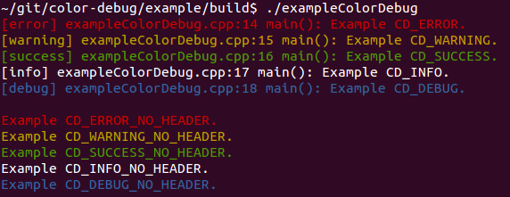

color-debug
===========

[](https://travis-ci.com/roboticslab-uc3m/color-debug)
[](https://github.com/roboticslab-uc3m/color-debug/issues)

Color CLI logs and more. Lightweight and simple, mainly achieved via [ANSI escape codes](https://en.wikipedia.org/wiki/ANSI_escape_code). For updated version, license and author information, see [ColorDebug.h](ColorDebug.h).

[](./)

Requirements: **CMake 2.8.12**.

Possible usages:

* Install system-wide: `mkdir -p ~/repos && cd ~/repos && git clone https://github.com/roboticslab-uc3m/color-debug && mkdir -p color-debug/build && cd color-debug/build && cmake .. && sudo make install`. In CMake, you may load it with `find_package(COLOR_DEBUG)` and then `target_link_libraries(myTarget ROBOTICSLAB::ColorDebug)`.

* Use externally: Skipping final `sudo make install` step, perform commands described above. Set the `COLOR_DEBUG_DIR` environment variable to your `build` path (optional, `color-debug` will store this path in the user registry for use by every `cmake` run). In CMake, you may load it with `find_package(COLOR_DEBUG)` and then `target_link_libraries(myTarget ROBOTICSLAB::ColorDebug)`.

* As part of another project: copy this repository to the desired location inside your source tree, make it discoverable by CMake (traverse its tree with `add_subdirectory(...)`) and add `target_link_libraries(myTarget ROBOTICSLAB::ColorDebug)` as usual.

* (**discontinued, last working commit was [5b8c9fd](https://github.com/roboticslab-uc3m/color-debug/commit/5b8c9fd7e24967ecaee3369f6ef99b7683f0f6f7)**) Pulled by [YCM](https://github.com/robotology/ycm). This is the `BuildCOLOR_DEBUG.cmake` file we use at [`kinematics-dynamics`](https://github.com/roboticslab-uc3m/kinematics-dynamics/):
  ```cmake
  include(YCMEPHelper)
  
  ycm_ep_helper(COLOR_DEBUG TYPE GIT
                STYLE GITHUB
                REPOSITORY roboticslab-uc3m/color-debug.git
                TAG master)
  
  # Include path to ColorDebug.h.
  ExternalProject_Get_Property(COLOR_DEBUG INSTALL_DIR)
  include_directories(${INSTALL_DIR}/${CMAKE_INSTALL_INCLUDEDIR})
  
  # CMake has not downloaded color-debug yet (this happens on build step).
  if(NOT COLOR_DEBUG_FOUND)
      message(STATUS "Build COLOR_DEBUG target and configure project again to make advanced CD options available on UI.")
  else()
      # Load COLOR_DEBUGConfig.cmake, which in turn includes ColorDebugOptions.cmake.
      find_package(COLOR_DEBUG QUIET)
  endif()
  ```
  Additionally, for every library or executable target that needs `ColorDebug.h`, you must use `add_dependencies(my_target COLOR_DEBUG)`. If you want to search for system-available `color-debug` first, add this to your root `CMakeLists.txt` after calling `find_or_build_package(COLOR_DEBUG)`:
  ```cmake
  if(USE_SYSTEM_COLOR_DEBUG)
      find_package(COLOR_DEBUG REQUIRED)
      include_directories(${COLOR_DEBUG_INCLUDE_DIRS})
      add_library(COLOR_DEBUG UNKNOWN IMPORTED)
  endif()
  ```

You can enable or disable specific features of color-debug by manipulating the corresponding CMake options. See [cmake/ColorDebugOptions.cmake](cmake/ColorDebugOptions.cmake) for details.

This utility adheres to the informal [`NO_COLOR` standard](https://no-color.org/), that is, ANSI color escape codes will not be generated in your ColorDebug-dependent project if the `NO_COLOR` environmental variable is defined (regardless of its value).

## Similar and Related Projects
- https://github.com/ikalnytskyi/termcolor
- https://github.com/rcfox/C-Header-For-ANSI-Colors
- Much larger and known project: https://www.gnu.org/software/ncurses
